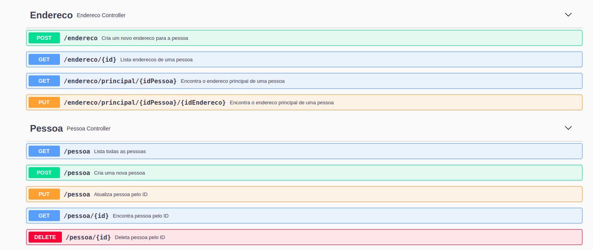

# Gerenciamento Pessoa-Endereço

O projeto foi realizado com Java, Spring Boot, Spring Data e banco de dados H2 como ferramentas principais.

Para rodá-lo, será necessário ao menos o **JRE 17** instalado na máquina e o gerenciador de dependências Maven - a versão **3.8.6** foi utilizada neste projeto

Após carregar o projeto, rode a aplicação pela classe main (PersonApplication). Um servidor deve estar rodando na porta 8080.

Caso deseje maiores informações sobre a API e como realizar consultas, acesse o endereço `http://localhost:8080/swagger-ui.html` para visualizar a documentação.

Para acessar o banco de dados h2, rodando no endereço `http://localhost:8080/h2-console/`, utilize o usuário sa e a senha `password`.

